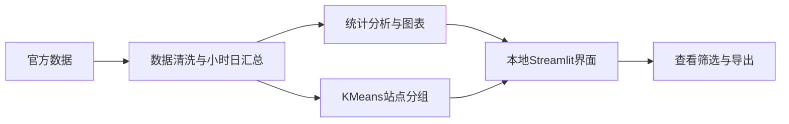

# 需求冻结版项目规格 v1.1（本科项目精简版）

**项目：上海地铁客流时空规律分析与可视化系统**

修订日期：2026-09-03，Asia/Shanghai。前四轮已确认项目范围；本版依据用户“在保留高级感的基础上剔除掉部分不适合出现在本科生项目的参数”的要求，精简工程结构、聚类评价和额外验收指标。开发尚未授权，用户明确说出“需求冻结，可以开发”后，Coding Agent 才能执行本文的开发 TODO。当前仅完成课程读取、需求整理和数据可行性验证，没有实现系统、训练模型或生成期末成果。

本文为后续实施的单一规格入口，取代《实施方案候选.md》中的候选表述。历史访谈保留在《课程约束与需求审讯记录.md》。课程原文《软件开发实践1-项目要求【2026.9】.docx》是课程验收依据；本项目增加的用户要求单独标明，不得伪装成老师统一规定。

本轮修改说明见《本科项目精简说明.md》，旧版原样保存在`history/需求冻结版项目规格-v1.0.md`，用于保留真实AI迭代证据。旧版的多模型评价、复杂工程目录和秒级性能门槛不再作为当前要求。完成度主要通过清楚的分析问题、统一界面、地图交互、可靠结果和可解释的答辩体现。

## 1. 项目目标与完成定义

选题为原文第1题“上海地铁数据分析及可视化”。用户选择理由：认为该题难度高，无其他理由；不补造选题动机。

使用2017年5–8月上海302站的公开聚合客流及辅助数据，回答五个明确问题，形成能离线演示、能够复现、结论可解释的本地系统。站点客流聚类用于增强出行模式分析。

完成必须同时满足：课程规定的清洗/预处理、描述性统计、客流规律与出行模式分析、地图可视化；本文确认的五个问题、六页系统、聚类、筛选与导出；Windows免安装异机运行；报告、PPT、四份个人调研和真实AI过程证据；源码ZIP体积与提交规范。

高分个人调研标准是写作目标，不是整个课程总评公式，也不构成成绩保证。

## 2. 范围、边界与优先级

**已确认范围**：2017-05-01至2017-08-31，全部302站；进出站10分钟聚合数据作为处理输入，小时/日汇总用于界面；站点经纬度/邻接、工作日历、小时天气；五项统计分析；站点聚类；纯本地交互与免安装便携交付。

**明确不做**：OD站间流向、个人轨迹/去重乘客画像、实际换乘路径或出行时长、客流预测、深度学习、实时采集/爬虫、当前年份地铁数据、任意文件上传、账户权限系统、在线服务/云部署、在线地图瓦片依赖。不得为了体现难度临时加入这些模块。

优先级含义：P0为课程验收项及满足交付所必需的用户硬约束，来源标C（课程）或U（用户）；P1为已选的完整度增强项，仍属于本次承诺，不允许静默删减；P2为未选增强，仅列备选，必须另获范围授权才做。

| 级别 | 本项目内容 | 来源及执行要求 |
|---|---|---|
| P0-C | 指定领域数据、预处理、描述性统计、客流规律、出行模式、地图 | 第1题原文硬要求 |
| P0-C | 期末报告、PPT、每人调研、README/注释、代码ZIP≤30M、规范提交 | 通用课程要求 |
| P0-U | 全部五个问题、完整时间/站点范围、六页、Windows拷贝即用/断网、真实AI全过程留档 | 用户确认的硬边界 |
| P1（已选） | 站点KMeans分组、轮廓系数与典型曲线解释、CSV/PNG导出、交互筛选 | 按本次精简方案实施 |
| P1（已选） | 个人报告按90–100档准备、实际异机运行记录、数据质量解释、统一视觉设计 | 用户质量目标 |
| P2（未选） | 地图时间动画、更多算法对照、额外气象事件专题 | 不进入当前开发清单 |

精确库版本的必要兼容修正、内部函数组织等可由Coding Agent落实并留档。本版已按用户要求简化模型和工程方案；今后减少时间/站点、删核心功能、改成需现场安装仍属于范围变更，不能自行处理。

## 3. 团队与分工

上午班[01]，4人，组长放首位，计划工作量各25%。学号经用户同意暂留待填，正式交付前必须补齐。

| 姓名 | 学号 | 计划负责范围 | 占比 |
|---|---|---|---:|
| 林睿信（组长） | 待填 | 需求及课程对照、架构与集成验收、进度、报告整合、最终材料复核 | 25% |
| 吴旻昊 | 待填 | 数据获取/字典、清洗与质量、统计口径、数据章节与复现核验 | 25% |
| 朱子墨 | 待填 | A–E统计与可视化、聚类及评价、结论解释、分析章节核验 | 25% |
| 邢雨晨 | 待填 | 交互和本地运行、异机测试、截图、PPT、AI过程附件 | 25% |

各人另负责本人调研报告的内容核验与理解。Codex承担用户要求的开发和材料生成；上述是责任安排，不是已经发生的人工开发事实。最终报告按实际参与记录，用户指导AI修改应写明“用户指导、AI执行”。

## 4. 课程要求 → 项目实现 → 报告章节 → 验收证据

需求编号供第4章需求、第6章结果、测试及截图清单共用。证据编号和文件名是未来采集计划，不表示文件已存在。

| 编号/来源 | 课程或用户要求 | 项目实现 | 报告位置 | 验收证据 |
|---|---|---|---|---|
| R01 C | 上海2017年5–8月地铁数据 | MetroFlow进出站及元数据，完整302站/123日 | 3、5.1 | 数据来源说明、行数与日期/站点统计 |
| R02 C | 数据预处理 | 类型、时间、重复记录、分项和、质量标记、关联与聚合 | 5.1、6.7 | 数据检查汇总、处理记录、S10 |
| R03 C | 描述性统计 | 总量、日均、分布、分组统计及统一单位 | 5.2、6.1–6.5 | statistics.csv、独立核对、S01–S06 |
| R04 C/U | 客流规律，问题A | 工作日/非工作日小时曲线及日期热力图 | 4.A、6.2 | S02、导出表、峰值结果 |
| R05 C/U | 地图，问题B | 离线站点地理图、繁忙站点排名 | 4.B、6.3 | S03、S04、断网运行证据 |
| R06 C/U | 出行模式，问题C | 早晚进出曲线与方向指数 | 4.C、6.4 | S05、指标计算核对 |
| R07 C/U | 出行模式，问题D | C/HBO/NHB类别数量及比例 | 4.D、6.4 | S06、分项一致性结果 |
| R08 U | 天气关联，问题E | 日客流与代表点天气分组关联 | 4.E、6.5 | S07、相关表及有效样本数 |
| R09 C可选/U已选 | 数据挖掘及相符评价 | KMeans站点分组、轮廓系数、典型曲线 | 4.F、5.3、6.6 | S08、S09、分组表和簇数比较表 |
| R10 U | 系统交互 | 六页，日期/日类型/站点/方向筛选 | 4流程、5.4、6各节 | S01–S10、筛选测试 |
| R11 U | 结果导出 | 当前统计CSV与当前图PNG | 4导出、6.8 | S11、实际导出文件、内容一致性检查 |
| R12 U | Windows拷贝即用 | Python和依赖随包，双击本地启动 | 2、5.5、6.8 | S12、另一台电脑的运行记录 |
| R13 C/U | README、注释、复现 | 根目录README、固定依赖、数据/构建命令 | 2、5、附交付说明 | 干净环境依文档复现记录 |
| R14 C | 代码ZIP≤30M | 独立源码ZIP≤30000000字节 | 交付说明 | 最终文件大小和交付清单 |
| R15 C | 团队与环境 | 四人各25%、学号、实际工具和版本 | 1、2 | 人员表、版本清单 |
| R16 C | 结果详述且呼应需求 | R04–R12逐项实际运行截图和解释 | 4 ↔ 6 | 本映射表全部对应项有证据 |
| R17 C/U | AI过程章及真实留档 | Prompt、初版、迭代、差异、实际人工参与 | 7、AI附件 | 原始对话、提交/快照、diff、日志 |
| R18 C | 报告模板及图表格式 | 使用原DOCX内报告模板 | 全文 | 版式检查、图表引用、无黄色提示 |
| R19 C/U | 每人调研、高档目标 | 四个不同主题，各≥1500字、≥5相关文献 | 四份独立报告 | 字数、文献真实性/相关性、逐篇复核 |
| R20 C | PPT、总包、命名、截止 | 约12页PPT及全部材料总ZIP | 交付清单 | 文件清单、大小、正确邮件主题及提交记录 |

## 5. 数据来源、规模与已验证事实

作者仓库：[MetroFlow](https://github.com/Ariza-Sun/MetroFlow)。正式数据：[Figshare](https://springernature.figshare.com/articles/dataset/Human_Mobility_Datasets_in_the_Complex_Metro_System_of_Shanghai/28844942)，许可CC BY 4.0；论文：[Sun等，Scientific Data，2025](https://www.nature.com/articles/s41597-025-05416-8)。公开的是从刷卡记录加工的聚合流量，原始七亿级刷卡规模不能写成本项目读取的行数。

2026-09-03已正常HTTPS取得完整进出CSV。证据：`docs/requirements/evidence/metroflow-full-profile.json`；数据：`data/raw/metroData_InOutFlow.csv`。

| 数据项 | 已确认情况 |
|---|---|
| 进出表 | 3,788,892行、13列，302站、123日 |
| 时间窗口 | 2017-05-01至08-31；每日[06:00,23:00)，102个10分钟时段 |
| 原文件字节数 | 217,442,845字节；对应ZIP压缩流50,109,160字节 |
| 网格结构 | 每天30,804行；全局timeslot为0–12,545，每日递增102 |
| 当前质量检查 | 全列空值0、流量负数0、重复主键0、整行重复0、进出分项不一致0 |
| 站点表 | 302条，stationID/name/lon/lat/neighbour，另有导出索引 |
| 日历 | 123条，date/isWorday，包含节假日和调休 |
| 天气 | 2,952条小时记录，2017-05-01 00:00至08-31 23:00；城市代表点天气 |

作者标出的六天是计数严重不足，不是CSV缺行，也不是全天全零。实际进站总量分别为：05-04=11,132；05-08=3,470；05-09=7,453；06-16=24,940；06-27=964；06-28=6,840。保留原数据，标记并排除常规分析/聚类；其他117日仍须通过常规校验。排除这六天对应184,824行，常规候选输入为3,604,068行；这是既定日期筛选数量，不代表已完成正式数据处理程序。

优先使用工作区已有的完整CSV。README提供官方来源及从下载包中提取所需文件的步骤，辅助数据提前备齐，答辩时不下载。不再要求开发专门的分段下载器。已有文件校验细节保留在证据JSON中，不放入主界面或作为答辩必讲内容。

## 6. 数据字典

### 6.1 进出客流表

下表为逻辑类型；现有自动读取曾将全部列推断为int64，实施必须重新赋予日期、时间和标识符语义。主键为(date,startTime,station)，同时验证(date,timeslot,station)唯一。

| 原始列 | 逻辑类型 | 意义/单位 |
|---|---|---|
| date | 日期，原始YYYYMMDD | 上海本地服务日期 |
| timeslot | 非负整数 | 跨服务日累计时段序号；0对应首日06:00，非午夜 |
| startTime | HHMMSS字符串→时间 | 含前导零的区间起点 |
| endTime | HHMMSS字符串→时间 | 区间终点，采用[start,end) |
| station | 站点ID | 与stationInfo.stationID关联，不把ID做连续数值特征 |
| inFlow | 非负整数 | 总进站人次 |
| outFlow | 非负整数 | 总出站人次 |
| CinFlow | 非负整数 | C：通勤出行进站人次 |
| HBOinFlow | 非负整数 | HBO：居家其他出行进站人次 |
| NHBinFlow | 非负整数 | NHB：非居家出行进站人次 |
| CoutFlow | 非负整数 | C：通勤出行出站人次 |
| HBOoutFlow | 非负整数 | HBO：居家其他出行出站人次 |
| NHBoutFlow | 非负整数 | NHB：非居家出行出站人次 |

人次是聚合进出站计数，不是去重乘客人数。C/HBO/NHB是发布方依其方法推断的行程类别，不是本项目训练出的分类结果。验证`inFlow=CinFlow+HBOinFlow+NHBinFlow`及相应出站等式。

### 6.2 辅助数据

| 表/字段 | 类型 | 意义与处理 |
|---|---|---|
| stationID | ID | 302站唯一键 |
| name | 字符串 | 源站名，允许保留源文并显示ID；中文别名需可追溯核对 |
| lon/lat | 浮点 | 发布经纬度；未声明CRS，不能擅称WGS84/GCJ02 |
| neighbour | ID数组 | 从字符串安全解析；校验邻站存在，不执行字符串代码 |
| 空表头索引列 | 导出索引 | 验证后剔除，不计入业务特征数 |
| 日历date | 日期 | 完整服务日期，唯一键 |
| isWorday | 0/1整数 | 原始拼写保留映射；1工作日、0非工作日，不以星期替代 |
| 天气date | 本地小时起点 | 无时区字符串按UTC+8解释并统一到Asia/Shanghai |
| temperature_2m | 浮点，°C | 2米温度 |
| apparent_temperature | 浮点，°C | 体感温度 |
| rain | 浮点，mm | 小时雨量；不擅自改称含雪等的总降水 |
| wind_speed_10m | 浮点，km/h | 10米风速 |

天气来自作者对31.2222N、121.4581E代表点的请求，不能说成302站逐站观测。原请求用Asia/Singapore，在此期间同为UTC+8。单位按作者未覆盖单位参数及[官方历史接口定义](https://raw.githubusercontent.com/open-meteo/open-meteo/main/openapi/historical-weather.yml)核查；数据说明保留来源、观测位置和单位。

### 6.3 处理后的数据文件

`station_hourly.parquet`：date、hour_start、station_id、8个汇总流量、is_workday、is_valid、quality_reason。完整小时应含6个唯一10分钟记录。

`station_daily.parquet`：date、station_id、8个日汇总、valid_slot_count、is_workday、is_valid、quality_reason。完整站日应含102个时段。

`network_daily.parquet`：date、8个全网日汇总、valid_station_count、is_workday、is_valid。全网有效日要求302个有效站日。

`weather_daily.parquet`：date、24小时温度/体感温度/风速均值、24小时rain总和、完整性标记；缺一小时即不输出完整日天气值。

另外保存站点表、日历、数据检查汇总，以及聚类分组表、平均曲线和轮廓系数表。聚类结果放在`data/processed/clusters/`，不单独建设模型管理目录。8个源流量列的口径全程不变，累计人次使用足够容量的整数保存。

## 7. 数据处理流程与保留策略

1. 确认使用完整的官方文件，记录来源、文件名、日期范围和行数；缺失文件时停止处理并提示准备方法。
2. 列名去首尾空白，检查13列齐全和额外列；解析日期/时间/ID/计数。
3. 完全相同行去重并记录；同主键但数值冲突的记录组隔离，不选择一条覆盖、不直接相加。
4. 非法日期/区间、非整数或负流量、必填缺失、分项不等式、未知站点记录隔离并标记受影响小时/日；当前已验证的原数据这些项目为0，也如实报告0。
5. 根据日历、站点、天气唯一键关联；禁止重复键连接使行数膨胀。关联前后记录行数与未匹配键。
6. 六个已知异常日独立加质量标记；用图说明计数缺损。零客流可以是真实观测，不等于缺失；高峰不因统计离群而截尾或删除。
7. 生成小时/日汇总和完整性标记。缺失区间不填0，缺失曲线显示断点。当前数据网格完整，但计数质量仍需六日标记。
8. 产生描述统计、数据检查汇总和聚类输入；保存检查结果及处理前后数量，供报告直接引用。

原始数据本地保留，便于复核，不装入代码ZIP。处理过程直接生成最终汇总，不要求专门保存一套中间数据。最终附带全部已确认范围的小时/日汇总、站点/日历/天气、质量摘要与聚类结果，保留四个月而非随机抽样。若压缩超限，先优化格式与重复产物，不能静默缩减站点或日期。

## 8. 统计分析的统一口径

定义：I(s,d,h)/O(s,d,h)为站点s、日期d、小时h的进/出汇总；D为当前筛选后、已通过相应完整性规则且不含六个异常日的日期集合。

- 全网日客流`N(d)=sum_s sum_h I(s,d,h)`，默认单位进站人次。`I+O`只称站点进出总量，不作去重客流人数。
- 站点日均`mean_s = sum_{d in D_s} daily_flow(s,d) / |D_s|`。排行采用各站共同有效日期交集，避免分母不同；详情可显示该站有效天数。
- 日期类型小时曲线默认`mean_g(h)=sum_{d in D_g} sum_s I(s,d,h)/|D_g|`，不能直接比较不同天数的累加总量。时间分析切换为出站时将I替换为O，峰值、标题、单位和导出同步切换；选择部分站点时求和只覆盖所选站点并修改范围名称。
- 描述统计：有效样本量、总量、均值、中位数、最小/最大；明细表可补充标准差。主界面仅放当前问题需要的指标，箱线图的四分位数交由绘图库计算，不再增加独立统计参数面板。
- 峰值以小时均值确定；并列峰值全部列出，需要一个定位值时取最早并说明并列。早峰[07:00,09:00)，晚峰[17:00,19:00)。
- 方向指数`B=(I-O)/(I+O)`，正值表示进站多，负值表示出站多。分母0时缺失。使用“进出方向指数”，避免将“净流入站点/城市”混称。
- C/HBO/NHB比例用同一方向的类别总和除以同方向总流量；不平均各行百分比；分母0显示不适用。
- 金额、速度等不存在于客流表的指标不创造。界面用万人次可缩放显示，导出保留原始人次并写单位。

天气分析按日进行，使用有效全网日进站量及完整24小时代表点天气。日均温度为24小时算术均值，rain为24小时求和，体感温度/风速为24小时均值（辅助字段）。分别在工作日、非工作日上计算温度/rain与日客流的相关系数，代码固定采用Spearman方法。界面写“相关系数”“有效天数”，帮助说明中解释计算方法；有效天数少于3或变量没有变化时显示不适用，不增加显著性检验或复杂统计面板。

有雨日定义rain日总和>0，无雨日=0；展示同日期类型的日客流分布及样本数。温度、rain是E的核心，风速和体感温度只作辅助上下文。不能通过复制302站天气行扩大独立样本量；讨论季节、月份和其他混杂，不把关联写成因果。

## 9. 核心问题与可视化方案

| 问题 | 核心统计/图表 | 为什么使用 | 应回答的结论形式 |
|---|---|---|---|
| A 工作日与非工作日高峰差异 | 双小时均值折线、日期×小时热力图 | 同一时间轴比较峰形，热力图暴露逐日差异 | 峰时、峰高、差异量；保留并列和质量限制 |
| B 繁忙站点及空间分布 | 前20站排序条形图、离线地理站点图 | 精确比较规模，并显示地理分布 | 哪些站排名靠前、集中在哪些位置；不等同拥挤 |
| C 早晚进出方向 | 进出双曲线、早/晚方向指数图 | 区分进站/出站时间方向 | 哪些站呈现何种方向特征，列数据支持 |
| D 三类出行差异 | 数量/100%堆叠条形图、类别时序 | 同时区分构成比例与绝对规模 | 哪类出行在何站/时段占比较高 |
| E 天气与客流关联 | 按日类型分色的散点图、雨日分组箱线图、相关表 | 展示分布与关联，防止只报告单个系数 | 关联方向、强弱、样本数及限制；允许无明显关联 |
| F 已选聚类增强 | 每组平均曲线、站点分组地图、轮廓系数表 | 看清相似曲线的站点如何分组 | 分成几组、各组有什么特点、分组是否清晰 |

核心图必须出现在实际系统并支撑报告；质量图、样本计数和辅助明细作为解释证据。不为了增加图数量重复同一信息。

地图使用源站点坐标和经过校验的邻接连线，以地理位置为依据，不用人为布局冒充地图。保持合理经纬度比例、坐标轴/地理说明、图例、悬停站名/ID/数值。CRS未说明时不与外部底图混叠；连线代表邻接关系，不声称是精确轨道形状。全中文界面，源站名可保留源文+ID；新增中文别名必须建立可追溯映射。

## 10. 聚类模型及评价方案

目的：把一天内进出站变化相似的站点分在一起，辅助解释出行模式。只使用KMeans一种算法；它按曲线形状的相似程度分组，结果便于用平均曲线说明。没有人工标注的目标类别，不是分类或预测任务。

输入仍覆盖2017年5–8月全部有效日期和最多302站，排除六个计数缺损日。每站计算工作日、非工作日各17个小时的进站和出站日均量。先在每种日类型内换算为占该站全天进出总量的比例，再合在一起，比较曲线形状。这样可避免只按大站、小站分组。缺失或整组为0而无法计算比例的站点需说明原因，不填假值。

供实现的必要细节：输入为`2种日类型×2个方向×17小时=68`个数；每种日类型的34个数合计为1，两种日类型同权。站点ID、坐标和天气不参与距离计算。此处保留精确口径，界面展示为“工作日/非工作日进出曲线”，不用向使用者暴露特征维数或算法参数面板。

基准设定为KMeans分3组，同时比较分2、4、5组的结果。各方案使用相同数据，以有效轮廓系数最高者确定最终组数，完全相同时取较小组数；若3组最佳就保留3组。固定随机种子42、重复初始化10次，写在代码中以保证结果可复现，不提供现场调参功能。基准仅是同一算法的初始分组方案，不声称做过跨算法比较。

只保留一个评价指标：**轮廓系数**，用于说明组内曲线是否相似、组间是否有区别。展示各候选组数的分数、最终每组站点数量、平均曲线及代表站。至少形成两个且少于样本数的有效组才计算该指标；无法计算时标为不适用，所有候选都不可用时如实说明并检查数据。没有真实分类标签，不报准确率、Precision、Recall或F1。

本任务描述这四个月已有站点的模式，全部有效数据用于分组，不再单独划分训练/验证/测试月份。选组数和评价使用同一批数据，属于探索性的内部评价，不能解释为预测能力或对未来月份的独立验证。报告应如实注明这一限制；不因分数低而删站、挑月份或捏造类别。

开发机提前计算分组，保存CSV形式的站点分组、各组平均曲线和候选组数评价表，并用一份简短说明记录日期范围与参数。系统读取固定结果，日期筛选不改变分组，现场不训练。类别名称先用“第1组”等中性名称，再根据实际曲线补充“早进晚出”等解释，不凭聚类证明土地用途。

## 11. 系统页面、模块与用户操作

| 页面 | 用户看到/操作 | 输出与需求 |
|---|---|---|
| 1 项目概览 | 项目问题、数据范围、有效日期数、站点数、客流摘要、进入各分析页 | R01、R03、R10；异常日期数量显著说明 |
| 2 时间规律 | 日期/日期类型筛选、小时曲线、日期热力图、峰值表 | A、描述统计、CSV/PNG |
| 3 站点空间 | 地图、前20排名、站点选择、进出方向 | B；悬停查看站名、ID、量和单位 |
| 4 出行模式 | 方向特征、类别构成、站点聚类三个标签页 | C、D、F；说明聚类使用的日期范围 |
| 5 天气关联 | 按日期及日类型看散点、雨日分布、相关系数和有效天数 | E；显示城市代表点、质量与因果限制 |
| 6 数据质量与说明 | 来源、字典、真实检查计数、异常六日、过滤前后对比、复现与AI说明 | R02；质量视图可看原值，不改变主分析规则 |

全局筛选：日期区间默认为四个月完整范围；日类型默认全部；站点默认全部，可选具体站；方向默认进站，可切出站，空间排行另允许明确标注的进出总量。所有图的标题/导出元数据包含实际范围与单位；选部分站时标题写“所选站点”，不能仍称全网。

不适用筛选需明确禁用并说明：天气核心分析固定为全网进站量，站点及进出方向控件在该页禁用；A的工作/非工作对比需要两类有效日期，否则只显示所选类别并提示；质量总览保留完整来源检查结果，另显示当前区间。聚类视图固定使用四个月有效日期计算的结果，日期、日期类型、进出方向控件在该视图禁用；用户可选分组或定位站点，不改变分组及评价，返回统计视图时恢复原筛选。

操作主线：完整解压便携包 → 双击启动 → 查看概览及质量提示 → 筛选日期/站点/方向 → 进入A–E及聚类 → 查看图和对应数表/解释 → 导出CSV/PNG → 通过明确停止入口关闭程序。筛选按界面状态立即更新并缓存结果，无需用户执行分析脚本。

导出：CSV使用UTF-8 BOM，包含明确列名/单位、日期范围、日类型、站点范围和有效样本数，不另配复杂元数据文件。PNG与当前图状态一致，图题、图例、单位、中文完整，不截断。数据字典和来源在说明页可查。用户不需上传数据或在答辩机运行下载/训练流程。

视觉要求：全站统一字体、色系、留白和图表样式；进站/出站、不同日类型的颜色全站一致。每页先展示分析问题和少量关键数字，再给主图、简短结论与可展开明细。保留地图悬停、筛选和下载这些有用交互。技术参数放在报告方法说明或代码注释中，页面不堆哈希、运行日志、调参控件和无关指标。高级感靠信息清楚和视觉一致，不额外引入动画框架或前后端分离。

## 12. 系统结构



保留简单分工：数据处理、统计分析、聚类、图表四个模块，`app.py`负责页面与交互。预先生成小时/日汇总和聚类结果，打开界面时直接读取；用框架自带缓存减少重复加载。使用本地文件，不设置独立数据库、后台任务系统或专门的运行管理模块。

## 13. 技术栈与运行命令

| 角色 | 确定版本/方式 |
|---|---|
| 开发环境/IDE记录 | Codex桌面工作区、编辑器与终端；未另指定独立IDE，报告按实际工具填写 |
| Coding Agent | OpenAI Codex |
| Python | CPython 3.13.15，标准GIL版本、Windows x64 embeddable |
| 本地框架 | Streamlit 1.49.1 |
| 数据处理 | pandas 2.3.2、NumPy 2.3.2、PyArrow 21.0.0 |
| 统计/机器学习 | SciPy 1.16.1、scikit-learn 1.7.1 |
| 图表 | Plotly 6.3.0、Matplotlib 3.10.6（Agg用于报告图） |
| 地图 | 本地Plotly站点/邻接连线及已核对资源 |
| 依赖管理 | 一份requirements.txt记录已验证环境的依赖版本；保留必要第三方许可 |

上述发布项及Windows wheel存在性已核查；完整组合兼容性仍需开发第一个门槛验证。参考[Python发行页](https://www.python.org/downloads/release/python-31315/)、[embeddable说明](https://docs.python.org/3.13/using/windows.html#the-embeddable-package)；各库文件证据见历史实施候选文档。必要兼容调整留变更记录并重新验证。

下列是开发后需要写入README的操作，当前脚本尚未实现。原始数据按README链接准备，数据处理及聚类由同一准备脚本完成：

```powershell
python -m pip install -r requirements.txt
python prepare_data.py
python -m streamlit run app.py --server.address 127.0.0.1
python -m unittest discover -s tests
python build_portable.py
```

开发/构建机器使用完整Python环境安装依赖；embeddable包只接收构建好的随附依赖，目标机不使用pip。普通答辩用户仅执行`启动.cmd`。Plotly PNG采用现有浏览器导出；不依赖需要额外Chrome的Kaleido运行链路。

## 14. 项目目录结构

以下为开发后的目标结构，不表示代码文件已经存在。当前保留课程原DOCX、需求文档、事实证据和已取得的原始进出CSV。

```text
项目根目录/
├─ README.md                       # 项目、安装、数据准备与使用说明
├─ app.py                          # 六个页面及筛选、导出
├─ prepare_data.py                 # 一次完成数据整理和聚类
├─ build_portable.py               # 生成拷贝即用的演示包
├─ requirements.txt                # 依赖及版本
├─ src/
│  ├─ data_processing.py           # 读取、检查、清洗和汇总
│  ├─ analysis.py                  # 客流统计及天气关联
│  ├─ clustering.py                # KMeans分组及轮廓系数
│  └─ charts.py                    # 统计图和离线地图
├─ data/
│  ├─ raw/                        # 原始数据，本地保留，不放进交付包
│  └─ processed/                  # 汇总数据、检查结果和clusters/分组结果
├─ assets/                        # 必要的本地图片、字体等
├─ tests/                         # 关键计算与数据检查
├─ docs/
│  ├─ requirements/               # 规格和已有需求记录
│  ├─ ai-process/                 # 真实对话和关键修改记录
│  ├─ screenshots/                # 系统截图及报告图
│  └─ deliverables/               # 报告、PPT、调研和交付说明
└─ dist/                          # 源码ZIP、便携包、最终总包
```

采用相对路径，不写死盘符、用户名或开发机目录；必要的框架配置和许可文件随包保留，无需增加专门管理层。`.venv`、原始数据、临时文件、缓存和dist不进入源码ZIP。团队名单写入README和报告，不单独维护人员配置文件。页面确实过长时可拆分，但不为展示目录规模而增加模块。

## 15. README要求

必须位于代码ZIP根目录，中文为主，至少包含：项目用途与五个问题；课程/数据来源；支持系统与Python精确版本；构建与开发依赖安装；默认数据内容及如何重新下载/清洗；源码启动命令与便携双击方式；六页操作、筛选、导出及模型说明；目录结构；常见问题。

FAQ至少覆盖：未完整解压、打开错入口、端口占用、浏览器未打开、数据损坏/缺失、中文路径、中文字体、空筛选、CSV编码、停止程序。明确源码包需要构建环境，便携包无需目标机安装；说明原始CSV不在代码ZIP以及校验/复现方法。

注明运行数据日期2017年、已排除的六个异常日、计数不是去重乘客、聚类不是预测、天气是代表点且只作关联。函数/模块必要注释解释关键口径和理由，避免大量无信息注释。

## 16. 便携包与双包交付

代码ZIP≤30,000,000字节，独立具备源码和复现说明；便携包不承诺同一体积限制。两者最终进入总压缩包。便携包预置全部分析数据和模型结果，不能打开后再下载运行环境或资料。

便携包只需明确三部分：双击启动入口、附带的Python及依赖、项目文件和处理后数据。运行环境仍然需要保留，它负责兑现“拷过去即可运行”；无需再编写独立的运行管理子系统。报告用“附带运行环境，双击打开本地网页”解释即可。

启动程序使用包内Python并打开浏览器，只监听本机。无需管理员权限，也不让使用者修改系统环境或安装软件。端口已占用或程序已打开时给出明确中文提示即可，不要求自动切换、复用实例或后台守护。后台启动隐藏窗口；提供简单关闭入口，只关闭本项目启动的程序，不影响其他应用。

地图、图表、字体、数据和聚类结果提前随包准备，断网时六页和CSV/PNG导出都可用。路径依据程序所在位置确定；用户导出位置由浏览器选择，不能覆盖原始数据。缺依赖时应在开发机补齐后重新打包，不把现场安装当成解决办法。

开发早期先做一个能在另一台Windows电脑打开的最小页面，验证便携方式，再扩充功能。具体封装细节由Coding Agent按兼容性解决；验收关注实际免安装运行，不把底层运行库名、解释器路径配置或进程管理技术列成学生必讲知识点。

## 17. 异常处理方案

| 情况 | 应有行为 | 证据/恢复 |
|---|---|---|
| 数据文件缺失/无法读取 | 指出文件名，并提供README中的准备步骤；停止受影响计算 | 重新准备正确文件 |
| 缺列/非法类型/重复记录冲突 | 列出异常和处理数量，不静默丢列/相加 | 数据检查汇总及修复说明 |
| 六个计数缺损日 | 保留原值、显著标记，排除常规分析/训练 | 质量页可看前后差异 |
| 日期反向/超范围 | 限制控件并显示中文校验 | 修正日期，不抛裸异常 |
| 全部选择均无有效数据 | 空状态及原因，无图/不适用指标 | 提示改选正常日期 |
| 零分母/恒定变量/小样本 | 指标“不适用”，不显示inf或伪造0 | 显示n与规则 |
| 站点/天气关联缺失 | 受影响分析标注或排除；其他不受影响页面可用 | 未匹配键清单 |
| 聚类结果缺失/内容错误 | 聚类页说明原因，不生成随机标签 | 开发机重新运行数据准备脚本 |
| 端口占用/重复启动 | 中文提示已有程序或端口不可用，说明关闭后重试 | 简单启动记录、关闭入口 |
| 无写权限 | 指定用户可写日志位置，导出交由浏览器 | 中文提示和目标路径 |
| PNG字体/背景缺失 | 验收失败并修复资源，不以空白图片交付 | 断网截图和实际导出文件 |

## 18. 测试与运行检查

使用标准库unittest为核心统计与质量规则做有意义测试；需要界面测试时可使用Streamlit自带测试能力和实际浏览器操作。不要用只镜像实现的测试替代独立算例。

| 测试组 | 必验内容 | 判定方式 |
|---|---|---|
| T01 数据检查 | 13列、日期/站点/时段、空值/重复记录/分项和 | 与已有源数据统计一致或解释差异 |
| T02 质量 | 有NA的合成记录、主键冲突、六个真实缺损日、真实零值 | 规则分别触发，普通零值保留 |
| T03 统计 | 不等天数的日均、进出不翻倍、分项占比、半开峰段、并列峰值、零分母 | 小型手算样例逐项一致 |
| T04 关联 | 重复元数据键导致膨胀、调休、24小时天气完整性 | 连接前后计数不误增，异常被识别 |
| T05 聚类 | 进出曲线比例、固定种子、同一输入比较2–5组、分组数量与轮廓系数 | 重算结果一致；各组站点数之和正确；日期筛选不改标签 |
| T06 交互导出 | 六页/三标签、四类筛选、空状态、CSV/PNG与当前图一致 | 浏览器实际操作与文件对照 |
| T07 便携 | 无Python、普通权限、断网、中文/空格路径、不同目录/盘符、端口冲突、停止 | 真实异机或干净VM日志及截图 |
| T08 使用体验 | 概览、常用筛选、单图/当前统计表导出 | 实际演示连续完成，无卡死、报错或无反馈等待 |
| T09 交付 | ZIP体积、文件齐全、学号/姓名、模板占位、引用、PPT | 自动清单检查+人工复核 |

目标平台Windows10/11 x64，推荐8GB及以上内存、有可用浏览器。取消原先20秒/3秒/5秒的额外硬门槛，不做专门性能压测。加载较久时显示进度或等待提示；在另一台电脑上完成一次完整演示：启动、切换六页、筛选、地图、导出、关闭，逐项记录是否成功及遇到的问题。

记录实际电脑系统、内存和测试日期即可，必要时补充真实等待时间，不声称未经验证的运行速度。尚未完成异机测试，不能仅凭规格或开发机运行就写“移机通过”。干净虚拟机可作补充验证，最终答辩电脑能提前测试时优先实测。

## 19. 报告截图与证据采集计划

使用最终交付包与固定数据版本采集。每个截图旁记录操作步骤、筛选条件、统计口径和结论；报告图序最后统一连续编号，证据ID不等于报告图号。

| ID / 计划文件 | 采集内容 | 报告第6章与需求 |
|---|---|---|
| S01 overview.png | 首次概览、范围、站点/有效日/核心指标 | 6.1，R01/R03/R10 |
| S02 time_patterns.png | 两种日类型小时曲线及日期热力图 | 6.2，A/R04 |
| S03 station_map.png | 离线站点图、图例、悬停信息 | 6.3，B/R05 |
| S04 station_ranking.png | 排名和日期/方向/站点筛选状态 | 6.3，B/R05/R10 |
| S05 direction_patterns.png | 某站早晚进出曲线及指数 | 6.4，C/R06 |
| S06 trip_types.png | 类别数量与比例、单位与有效期 | 6.4，D/R07 |
| S07 weather_relation.png | 天气散点、雨日分布、相关系数、有效天数及限制 | 6.5，E/R08 |
| S08 cluster_profiles.png | 分组、平均曲线、代表站、数据日期 | 6.6，F/R09 |
| S09 cluster_evaluation.png | 2–5组轮廓系数比较及各组站点数量 | 6.6，R09 |
| S10 data_quality.png | 六日残余量、原始检查、排除前后 | 6.7，R02 |
| S11 export_workflow.png | 当前筛选→CSV/PNG导出过程 | 6.8，R11 |
| S12 portable_run.png | 另一台无Python电脑的双击启动及页面 | 6.8，R12 |

截图可根据实际布局合并或拆分，但必须保留需求对应；不能用设计稿或论文图冒充系统截图。样本数、分组评价、文件体积保留实际统计表或运行记录，截图用于说明操作和结果。

## 20. 期末报告章节映射与排版

采用课程DOCX内提供的封面和八章结构，不重新索取已存在模板。标题、分工、环境等写真实内容。

| 章节 | 必须写入的项目内容 |
|---|---|
| 1 团队成员组成及分工 | 学号、姓名、组长顺序、具体模块职责、各25%；与实际参与核对 |
| 2 项目开发环境 | Codex实际工具、Python3.13.15、核心库及实际验证版本、目标Windows及便携方式 |
| 3 数据说明 | 来源/许可、实际3788892×13、302站/123日、辅助字段、聚合计数语义、六日计数缺损 |
| 4 需求分析 | R01–R20与A–F、六页模块图、用户业务流程、四类筛选/导出/本地启动 |
| 5 系统设计和实现 | 数据清洗和汇总、主要统计公式、KMeans与组数比较、简单系统结构、离线运行方式、必要代码及设计原因 |
| 6 结果分析（重点） | 按6.1–6.8实际操作截图、五个问题的真实发现、模型指标、质量限制、导出与移机结果；逐条呼应第4章 |
| 7 AI辅助过程 | 真实Prompt、AI初版、关键迭代、用户指导/实际人工修改、差异；全文材料指向独立附件 |
| 8 总结 | 已完成成果、有证据的创新/改进、局限和可扩展点，不虚构算法创新或成绩 |

正文中文宋体小四（12pt），英文Times New Roman小四；固定20磅行距，首行缩进2字符。项目名称黑体三号、居中。图嵌入文本行中，图所在段单倍行距；图下“图序+图名”，宋体五号、居中、连续编号且正文引用。表上“表序+表名”，同为宋体五号、居中、连续编号且正文引用。

正式提交删除所有黄色提示文字及未填写占位。图表数字必须来自同版系统/导出数据；必要代码只截取解释设计的片段，不能把第5章变成代码堆积。参考文献按学校/模板所用格式统一，不把检索引文工具结果不经核对直接粘入。

## 21. AI辅助过程留档方案

当前确实存在：本Codex任务中的完整用户Prompt和历史对话；本地结构化访谈、候选方案、本规格、数据Range/完整文件核验JSON及原始CSV。**完整对话尚未导出成本地全文，不能声称全量本地归档已完成。**

开发开始前先备份当前原始对话或按原文保存Prompt/回复，标明导出方式及范围。以后每个里程碑保留：原始需求Prompt、AI首次产物快照、遇到的问题/错误、关键修改Prompt、修改前后diff、实际用户决策/人工修改、测试结果与最终产物版本。

留档用一份按日期整理的`AI过程记录.md`，配合原始对话备份与关键版本快照即可，不强制拆成多层目录或维护专门索引表。每轮记清“用户提出什么、AI初版是什么、发现什么问题、如何修改、怎样验证”，附修改前后文件或差异。已有历史记录和证据继续保留；使用Git时，大数据和环境不入仓库。

资料多时形成`AI辅助过程附件.docx`，第7章概述并引用。原始记录可以单独附在总包中，不挤入代码ZIP。没有人工修改就如实描述实际核验与指示，不编造全过程、时间、首版代码或性能结果。保留原始稿，编辑附件时不覆盖原始证据。

## 22. 答辩PPT与演示脚本

用户接受按约10分钟、12页准备；这不是老师已通知的时长，收到正式通知后调整节奏。

1. 项目、团队、分工。
2. 五个分析问题与课程要求。
3. 数据来源、真实规模和字段。
4. 六日计数缺损及预处理。
5. 架构、六页与免安装运行。
6. A：时间高峰规律。
7. B：繁忙站点与地图。
8. C/D：进出方向与出行构成。
9. E：天气关联及限制。
10. F：KMeans分组、轮廓系数和代表站解释。
11. 实际操作、导出和异机验收。
12. 总结、AI使用和改进方向。

准备约7分钟讲解+3分钟操作：启动概览→质量提示→时间/站点筛选→地图→出行/聚类→天气→导出。预先选定有代表性、实际核查过的站点和日期，写入演示脚本；不能先编结论再挑图。截图作为故障说明备份，不能替代正常运行验收。

每人能解释负责模块及基础问题：人次与人数、为何排六日、日均分母、地图依据、天气关联不能证明因果、按什么曲线分组、为什么用轮廓系数、源码包与便携包区别、AI实际参与。实现章节聚焦“为什么这样处理数据、图能回答什么、结果说明什么”，不要求讲运行库封装等底层细节。

## 23. 四份个人调研报告

| 成员 | 已分配主题方向 | 与期末报告的区别 |
|---|---|---|
| 林睿信 | 轨道交通客流大数据在智能运营中的技术发展与产业应用 | 研究行业运营技术及应用，不复述本系统六页 |
| 吴旻昊 | 自动售检票数据质量治理、隐私保护与开放共享 | 研究数据治理方法、标准与应用案例 |
| 朱子墨 | 轨道交通出行模式识别与站点聚类技术及应用 | 比较领域方法与证据，不只解释本组KMeans代码 |
| 邢雨晨 | 轨道交通客流可视分析与交互式决策支持技术及应用 | 比较可视分析设计与产业使用，而非截图合集 |

每篇正文至少1500字，封面/目录/参考文献不充当正文字数；至少5篇真实且高度相关的独立参考文献。围绕前沿发展与产业现状，结构清晰、文字流畅、内容完整、材料丰富；选取可核查的国内实践讨论公共交通服务责任、技术自主发展等，落实课程要求的使命感、责任心与民族自豪感，避免无依据口号。

推荐结构：背景与问题→技术路径与发展→产业案例→困难与趋势→个人认识→参考文献。逐条核验作者/题名/年份/来源/DOI或链接，并与正文观点对应。当前尚未检索出每篇完整文献清单，不得写成已完成调研。

## 24. 最终交付清单、命名与截止

项目全名：上海地铁客流时空规律分析与可视化系统。班级[01]，缩写“地铁”，姓名顺序已确认。

邮件主题：`[01]林睿信_吴旻昊_朱子墨_邢雨晨_地铁`

总包：`[01]林睿信_吴旻昊_朱子墨_邢雨晨_地铁.zip`

```text
总压缩包/
├─ 小组期末报告.docx
├─ 答辩PPT.pptx
├─ 代码.zip                         # ≤30,000,000字节，根目录README.md
├─ 便携演示包.zip                   # 实际体积另测，解压双击运行
├─ 林睿信-调研报告.docx
├─ 吴旻昊-调研报告.docx
├─ 朱子墨-调研报告.docx
├─ 邢雨晨-调研报告.docx
├─ AI辅助过程附件.docx
├─ AI原始记录/                      # 已导出的原始对话/必要快照与差异
└─ 交付清单与运行说明.md             # 文件清单、代码包大小、启动及数据来源
```

总包不包含217MB原始CSV、OD、开发虚拟环境缓存或重复中间数据；便携包自己的必要运行环境必须包含。课程只给代码ZIP规定30M，不声称总包也≤30MB。总包大小与邮件附件传输能力必须在截止前验证；不能临时自行用网盘链接替代老师要求的交付。

收件地址：jfyh2010@qq.com。截止：**2026-09-08 23:00前，Asia/Shanghai**。最终发送动作须取得用户明确授权；本规格只规定交付准备，不授权自动发邮件。发送后保存回执/已发送记录，未发送不能声称已提交。

## 25. 风险、状态与应对

| 风险/待办 | 当前状态 | 处理与责任 |
|---|---|---|
| 数据是否能拿到 | 已解除主要阻碍：完整进出文件已取得并核验 | 吴旻昊保留文件及来源，提前备齐辅助数据 |
| 完整表格掩盖真实计数缺损 | 已证实六日低残余量，非缺行 | 固定质量标记、报告前后对比 |
| 源站名与坐标参考系 | 有源名/坐标，CRS未声明 | 本地坐标图；不混叠未经验证底图；别名留来源 |
| 依赖及离线资源 | 仅确认发行文件存在，未完成运行验证 | 林睿信/邢雨晨先验证便携页面，保留可用版本和必要资源 |
| 代码ZIP超限 | 原始表已外置，最终汇总和字体体积未测 | 无损格式、剔除重复物，实测字节数；不静默缩减范围 |
| 便携总包较大、邮件传输 | 未测 | 提前构建和测试最终附件，不等最后一小时 |
| 聚类区分不明显 | 尚未计算；精简后只有内部评价 | 如实展示轮廓系数及曲线，不宣称预测能力或强行解释土地用途 |
| 天气因果误解/重复样本 | 方法已限定 | 日期为观测单位、日类型分层、明确混杂 |
| 另一台电脑能否运行 | 尚未验证 | 实际移机完成完整演示，记录机器条件和问题 |
| 内容太多、答辩难解释 | 本版已缩减工程结构和算法评价 | 保留关键口径与解释；不要在实现阶段补回已取消的指标和管理层 |
| 学号和正式答辩时长 | 学号经用户同意待填；时长按10分钟编排 | 组长在最终校对前补齐学号并核对通知 |
| AI原始全文备份 | 当前在对话，尚未本地全量导出 | 开发首步备份；不删除当前Codex任务 |
| 报告/PPT/个人研究实际成果 | 均尚未生成 | 按真实运行和检索结果制作，不能提前写结论 |

## 26. 开发优先级、里程碑与可执行TODO

以下工作仅在明确开发授权后执行。用户已确认9月7日18:00达到“可演示+全部材料初稿”，9月8日23:00为外部硬截止；更细日程是执行安排，可在不影响硬节点的情况下调整。

| 阶段 | 建议时间 | 执行TODO | 完成证据 |
|---|---|---|---|
| D0 授权与留档 | 开发首步 | 记录冻结授权；备份原始对话；创建README/目录/Git及忽略规则；保留当前数据证据 | 授权记录、初始快照 |
| D1 最关键可行性 | 9月3日 | 安装并记录可用依赖；打包最小Streamlit页面；验证包内环境、离线资源、中文路径；写清数据准备方法 | requirements.txt、启动记录、数据说明 |
| D2 数据与口径 | 9月4日 | 获取/核验三种辅助数据；解析13列、日期质量标记、分项/关联检查、小时/日汇总；实现T01–T04 | 数据检查汇总、处理后数据、统计测试 |
| D3 核心系统 | 9月5日 | 完成概览和A–E六页、离线地图、四类筛选、CSV/PNG；早测包内数据体积 | 六页可运行、T06及初次打包 |
| D4 已选P1 | 9月6日 | 用四个月有效日曲线做KMeans；比较2–5组轮廓系数，保存分组和平均曲线；集成分组地图与说明，统一各页视觉 | T05、实际评价表、聚类页面 |
| D5 材料与移机 | 9月6–7日 | 采S01–S12；写八章报告、四份真实文献调研、约12页PPT和AI附件；另一台电脑断网演示和导出 | 完整初稿、测试记录、截图索引 |
| D6 内部完成 | 9月7日18:00前 | 程序可演示，所有材料初稿齐全；列余下缺陷，不含未实现主功能 | 里程碑清单 |
| D7 最终交付 | 9月8日 | 修复、模板排版、学号补齐、引用与文字校对、源码/便携/总包验证、附件传输检查；获授权后发送 | 最终文件清单与大小、提交回执 |

执行顺序：先P0可运行和正确统计，再兑现已选P1模型/导出等，最后润色；P2不启动。个人文献检索与材料骨架可在界面开发期间推进，但最终结果段只能在实际运行后完成。

## 27. 最终验收Checklist

以下默认未完成，不能因规格已写就勾选。现有数据事实另有profile证明，不代表完整项目通过。

- [ ] 已有用户明确“需求冻结，可以开发”的授权记录。
- [ ] 第1题原文硬要求均映射到实现及证据，未混入其他选题要求。
- [ ] 项目保持全部302站、四个月范围，无未经同意的抽样或OD扩展。
- [ ] 原始数据来源、许可、实际行数和重新准备方法完整。
- [ ] 13列及辅助数据字典、逻辑类型、单位、主键和时间语义正确。
- [ ] 预处理可复现；真实检查值如实记录，六日残余计数正确标注并排除。
- [ ] 进出人次、日均分母、调休、峰值/比例/零分母及天气样本口径通过独立核对。
- [ ] A–E均有核心图、数表及实际结论或无明显关系的解释。
- [ ] 地图离线可用、坐标/连线说明明确，中文完整。
- [ ] 六页、出行模式三标签、四类筛选、空状态及错误提示实际可用。
- [ ] CSV/PNG与当前筛选一致，脱网导出成功。
- [ ] KMeans使用四个月有效数据，比较2–5组，结果可重现。
- [ ] 轮廓系数、各组站点数和平均曲线真实，说明仅为现有数据的内部评价。
- [ ] 固定标签来源期间清楚，现场不训练，日期筛选不暗改类别。
- [ ] Windows10/11 x64无Python普通权限环境中，解压双击即可用。
- [ ] 中文/空格路径、不同位置、端口冲突、重复启动、停止行为通过。
- [ ] 另一台电脑完整演示六页、筛选和导出，无卡死或报错，有真实记录。
- [ ] 页面字体/颜色/图例一致，参数不堆在界面，核心图配简短解释。
- [ ] 代码ZIP根目录README.md齐全，代码有必要注释，固定依赖可复现。
- [ ] 代码ZIP实际≤30000000字节，便携包包含完整环境和数据。
- [ ] 期末报告八章齐全，第4与第6章逐项对应S01–S12。
- [ ] 正文/图表/编号/引用满足模板，删除全部黄色提示及占位。
- [ ] 学号填写，四人姓名/组长顺序/25%计划与实际说明核对。
- [ ] 四份独立调研正文≥1500字、参考文献≥5且真实相关，满足其他最高档标准。
- [ ] PPT与最终系统结果一致，答辩流程演练完成。
- [ ] 原始Prompt/回复已备份，初版/迭代/diff/实际人工核验可追溯，AI附件真实。
- [ ] 总包包括两ZIP、期末报告、PPT、四份个人报告、AI附件及清单。
- [ ] 邮件主题/总包名为[01]林睿信_吴旻昊_朱子墨_邢雨晨_地铁。
- [ ] 总包可解压、附件传输可行、收件邮箱正确。
- [ ] 2026-09-08 23:00前获用户发送授权并完成提交，保留回执。

## 28. Coding Agent接手指令

先读取本规格、课程原DOCX中第1题和通用提交/报告要求，以及当前事实证据。确认对话中已有明确开发授权后再执行D0–D7；没有该授权时只可解释或修改规格。

利用现有已校验CSV，不重复下载大包或OD。先验证便携环境和数据处理，再实现界面与聚类；将每个需求、测试、报告结果和证据ID对应起来。聚类指标、运行记录、截图和调研引用必须真实生成，不以计划冒充结果。按本版精简结构实施，不重新增加多算法对照、稳定性指标、模型管理、分段下载器或专门进程管理模块。遇到实现问题先在既定范围内修复；只有涉及范围变化、真实缺失的用户信息或外部无法访问的演示环境时再指出具体阻碍。

本次需求审讯到此收敛。后续待填学号、正式答辩通知、实际测试结果属于已登记的交付事项，不再通过泛化提问延长访谈。
